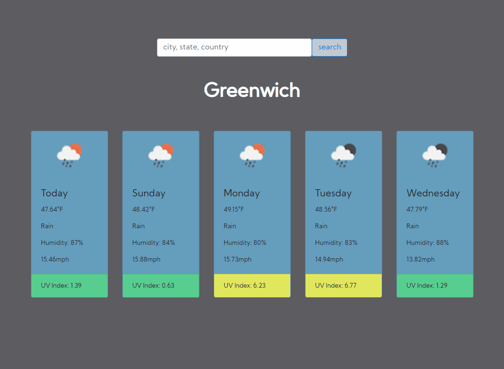

# Wearch Search API

User can search location by city, state, or country name. On search the app searches through openweather's API in order to retrieve weather icon, temperature, weather type, humidity, wind speed, and ui vindex (searched through separate fetch api since uv was not within api searchable by location name, only lat/long) which then becomes appended for view. The search history div will retain up to 6 previously searched, which can be clicked/pressed to automatically search previously searched location, and continuously replaces the list once it hits the limit so the search history doesn't spill too far down the page. UV Index is color coded to show from safe levels to dangerous levels green, yellow, red. Each card also displays the days of the week, including a static "today" slot. Mobile friendly media query added.

## Demo

  
## Lessons Learned

This project was a lot of fun but also frustrating at times. At one point I was debating on natural JS vs jQuery but I opted to mix a bit of jQuery for the most dynamic feature with the search history. I was stuck for hours at a time on certain portions involving scope issues, most of them which were quite simply being syntaxes being placed within the wrong statement or loop. It was really tough figuring out how to keep a running history list that continuously replaces itself once a limit was reached, but it was a satisfying victory that was achieved by utilizing something we learned towards the beginning of the course with shifting and popping from arrays. I was looking for too complicated of an answer thinking my loops and statements weren't being written properly, but it was just a matter of shifting out elements within the array to generate a clean list. I wasn't comfortable enough to jQuery every element, but moving forward it might be worth to take time to figure out which portions would be more efficient in jQuery vs natural JS.
  
## Deployment

https://eccentricality.github.io/weatherSearch/

  